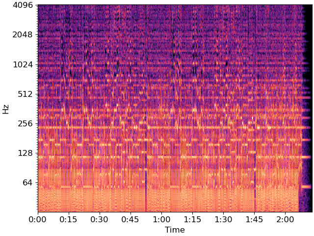
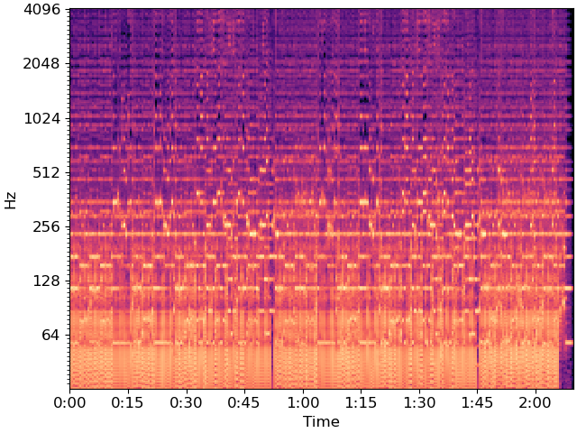
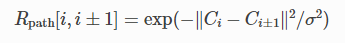
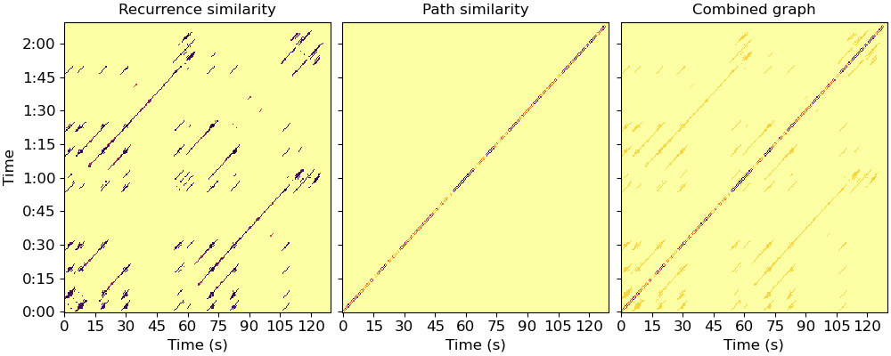

# Laplacian Segmentation

この notebook では、[McFee and Ellis, 2014 のラプラシアン分割法](http://bmcfee.github.io/papers/ismir2014_spectral.pdf) を実装し、いくつかの細かい安定性の改善を行いました。

例題を通して、論文中の方程式を番号で参照しますので、読み進めると便利です。

```python
# Code source: Brian McFee
# License: ISC
```

インポートするパッケージ

- `numpy` ：基本的な機能のため
- `scipy` ：グラフのラプラシアン
- `matplotlib` :可視化用
- `sklearn.cluster` ：K-Means用

```python
import numpy as np
import scipy
import matplotlib.pyplot as plt

import sklearn.cluster

import librosa
import librosa.display
```

はじめに、音楽をロードします。

```python
y, sr = librosa.load(librosa.ex('fishin'))
```

次に、log-power CQTを計算してプロットします。

```python
BINS_PER_OCTAVE = 12 * 3
N_OCTAVES = 7
C = librosa.amplitude_to_db(np.abs(librosa.cqt(y=y, sr=sr,
                                        bins_per_octave=BINS_PER_OCTAVE,
                                        n_bins=N_OCTAVES * BINS_PER_OCTAVE)),
                            ref=np.max)

fig, ax = plt.subplots()
librosa.display.specshow(C, y_axis='cqt_hz', sr=sr,
                         bins_per_octave=BINS_PER_OCTAVE,
                         x_axis='time', ax=ax)
```



次元削減のために、CQTをビート同期させます。

```python
tempo, beats = librosa.beat.beat_track(y=y, sr=sr, trim=False)
Csync = librosa.util.sync(C, beats, aggregate=np.median)

# プロットのためにビートのタイミングが必要
# ビートでないフレーム 0 と C.shape[1]（最終フレーム）を含むように
# fix_frames を設定
beat_times = librosa.frames_to_time(librosa.util.fix_frames(beats,
                                                            x_min=0),
                                    sr=sr)

fig, ax = plt.subplots()
librosa.display.specshow(Csync, bins_per_octave=12*3,
                         y_axis='cqt_hz', x_axis='time',
                         x_coords=beat_times, ax=ax)
```



ビート同期 CQT (式 1) を使用して加重再帰行列を構築しましょう。
`width=3` は同じバー内のリンクを防ぎます。
`mode='affinity'` 、ここで S_rep を実装します (式 8 の後)。

```python
R = librosa.segment.recurrence_matrix(Csync, width=3, mode='affinity',
                                      sym=True)

# median フィルタによる対角線強調（式2）
df = librosa.segment.timelag_filter(scipy.ndimage.median_filter)
Rf = df(R, size=(1, 7))
```

ここで、mfcc-similarity を用いてシーケンス行列(S_loc)を構築してみましょう。



ここでは、連続するビート間の距離の中央値としています。

```python
mfcc = librosa.feature.mfcc(y=y, sr=sr)
Msync = librosa.util.sync(mfcc, beats)

path_distance = np.sum(np.diff(Msync, axis=1)**2, axis=0)
sigma = np.median(path_distance)
path_sim = np.exp(-path_distance / sigma)

R_path = np.diag(path_sim, k=1) + np.diag(path_sim, k=-1)
```

そして、バランスのとれた組み合わせ計算をおこないます（式6、7、9）。

```python
deg_path = np.sum(R_path, axis=1)
deg_rec = np.sum(Rf, axis=1)

mu = deg_path.dot(deg_path + deg_rec) / np.sum((deg_path + deg_rec)**2)

A = mu * Rf + (1 - mu) * R_path
```

出来上がったグラフをプロットします（図1の左および中央）。

```python
fig, ax = plt.subplots(ncols=3, sharex=True, sharey=True, figsize=(10, 4))
librosa.display.specshow(Rf, cmap='inferno_r', y_axis='time', x_axis='s',
                         y_coords=beat_times, x_coords=beat_times, ax=ax[0])
ax[0].set(title='Recurrence similarity')
ax[0].label_outer()
librosa.display.specshow(R_path, cmap='inferno_r', y_axis='time', x_axis='s',
                         y_coords=beat_times, x_coords=beat_times, ax=ax[1])
ax[1].set(title='Path similarity')
ax[1].label_outer()
librosa.display.specshow(A, cmap='inferno_r', y_axis='time', x_axis='s',
                         y_coords=beat_times, x_coords=beat_times, ax=ax[2])
ax[2].set(title='Combined graph')
ax[2].label_outer()
```



ここで、正規化ラプラシアン（式10）を計算してみましょう。

```python
L = scipy.sparse.csgraph.laplacian(A, normed=True)

# および、そのスペクトル分解
evals, evecs = scipy.linalg.eigh(L)


# We can clean this up further with a median filter.
# This can help smooth over small discontinuities
evecs = scipy.ndimage.median_filter(evecs, size=(9, 1))


# cumulative normalization is needed for symmetric normalize laplacian eigenvectors
Cnorm = np.cumsum(evecs**2, axis=1)**0.5

# If we want k clusters, use the first k normalized eigenvectors.
# Fun exercise: see how the segmentation changes as you vary k

k = 5

X = evecs[:, :k] / Cnorm[:, k-1:k]


# Plot the resulting representation (Figure 1, center and right)

fig, ax = plt.subplots(ncols=2, sharey=True, figsize=(10, 5))
librosa.display.specshow(Rf, cmap='inferno_r', y_axis='time', x_axis='time',
                         y_coords=beat_times, x_coords=beat_times, ax=ax[1])
ax[1].set(title='Recurrence similarity')
ax[1].label_outer()

librosa.display.specshow(X,
                         y_axis='time',
                         y_coords=beat_times, ax=ax[0])
ax[0].set(title='Structure components')
```
